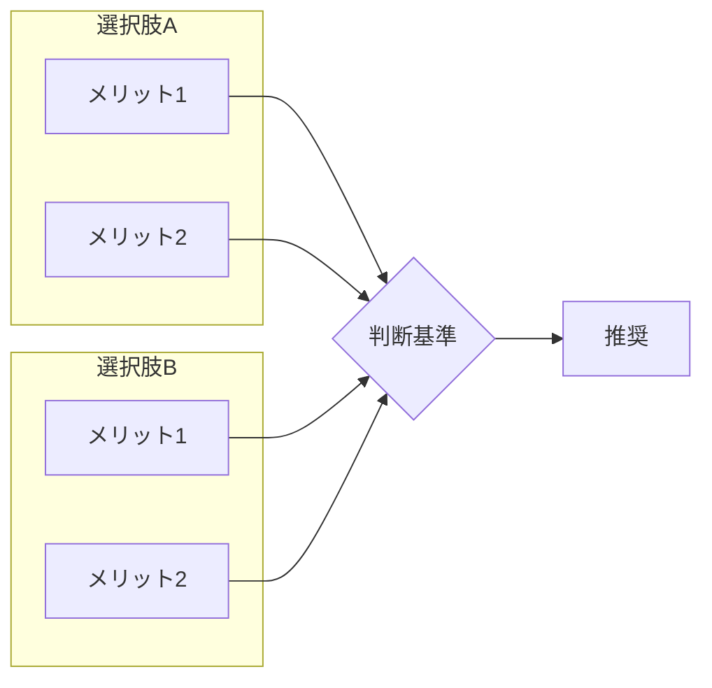
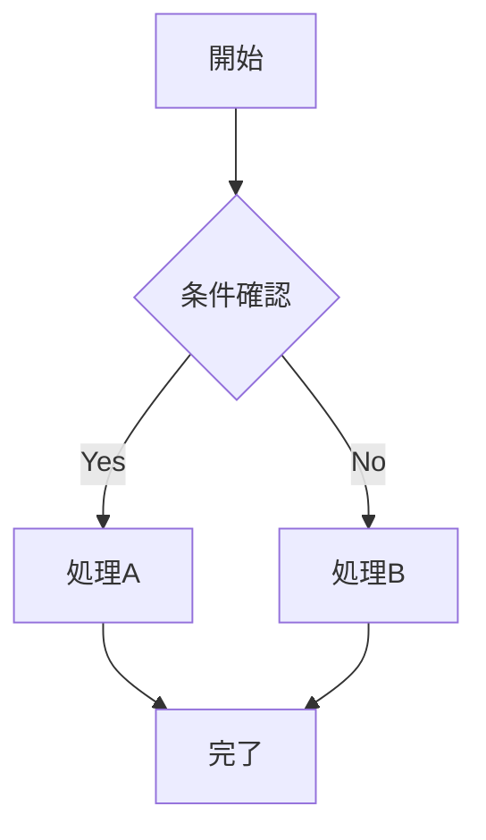
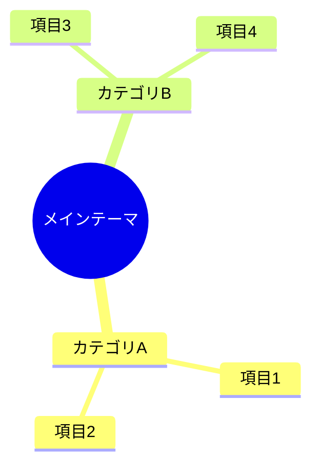
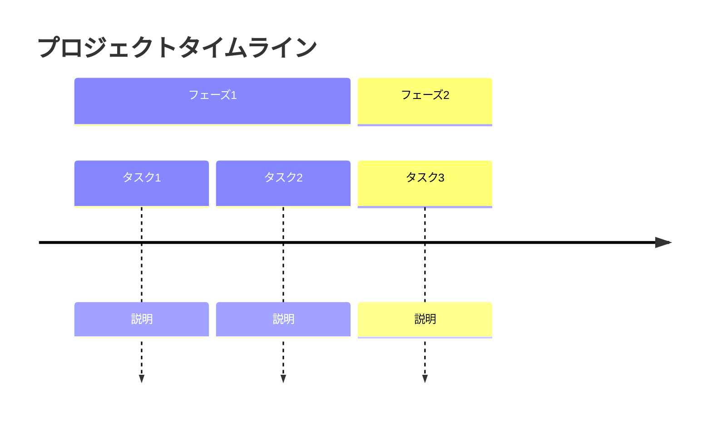

# Topic Common Guidelines

このファイルはTopic系エージェント共通のドキュメント作成ガイドラインです。
各エージェントはこのガイドラインに従ってMarkdownファイルを生成してください。

---

## Mermaid図表の活用

### 基本方針

調査結果や結論を視覚的に整理する際は、**積極的にMermaid記法を活用**してください。
テキストだけでなく図表を含めることで、情報の理解が大幅に向上します。

### 図表タイプの選択ガイド

| 表現したい内容 | 推奨Mermaidタイプ | 使用例 |
|--------------|------------------|--------|
| 選択肢の比較 | `graph LR` | 製品比較、技術選定 |
| プロセス・手順 | `flowchart TD` | ワークフロー、意思決定フロー |
| 時系列の情報 | `timeline` | プロジェクト計画、歴史的経緯 |
| 概念の関係性 | `mindmap` | 概念整理、ブレインストーミング |
| 階層構造 | `graph TD` | 組織構造、カテゴリ分類 |
| 状態遷移 | `stateDiagram-v2` | ステータス管理、ライフサイクル |
| シーケンス | `sequenceDiagram` | API連携、処理フロー |

### 使用例

#### 比較図（選択肢の整理）



#### フローチャート（プロセス・手順）



#### マインドマップ（概念整理）



#### タイムライン（時系列）



### 図表作成のベストプラクティス

1. **シンプルに保つ**: 1つの図に詰め込みすぎない（ノード数は10個程度まで）
2. **ラベルを明確に**: 略語を避け、わかりやすい名称を使用
3. **適切な方向**:
   - 上から下（TD）: 階層・プロセス
   - 左から右（LR）: 時系列・フロー
4. **色やスタイルは控えめに**: 必要な場合のみ使用

### いつMermaidを使うべきか

以下の場合は積極的にMermaidを使用:

- [ ] 3つ以上の選択肢を比較する場合
- [ ] 複数のステップがあるプロセスを説明する場合
- [ ] 概念間の関係性を示す場合
- [ ] 時系列で情報を整理する場合
- [ ] 複雑な条件分岐を説明する場合

---

## その他の視覚化ガイドライン

### 表（テーブル）の活用

比較データや構造化された情報には表を使用:

```markdown
| 項目 | 値A | 値B | 備考 |
|------|-----|-----|------|
| 価格 | ¥100 | ¥200 | Aが安い |
| 機能 | 基本 | 高機能 | Bが充実 |
```

### 箇条書きの階層化

情報の階層構造を明確に:

```markdown
- 大カテゴリ
  - 中カテゴリ
    - 詳細項目
```

### アイコン・絵文字の使用

ステータスや重要度を視覚的に示す（控えめに使用）:

| 用途 | アイコン |
|------|---------|
| 完了・成功 | ✅ |
| 警告・注意 | ⚠️ |
| エラー・失敗 | ❌ |
| 情報・ヒント | 💡 |
| 重要 | ⭐ |

---

## 品質チェックリスト

ドキュメント生成時に確認:

- [ ] 複雑な情報にはMermaid図表を使用したか
- [ ] 図表はシンプルで理解しやすいか
- [ ] テキストと図表のバランスは適切か
- [ ] 表は正しくフォーマットされているか
