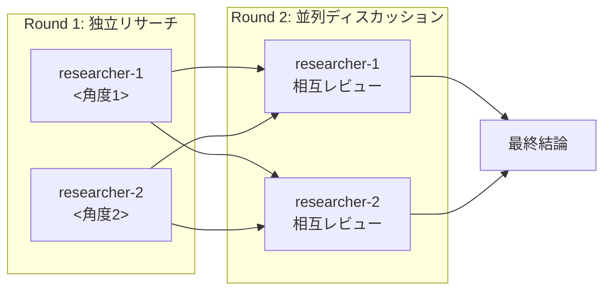
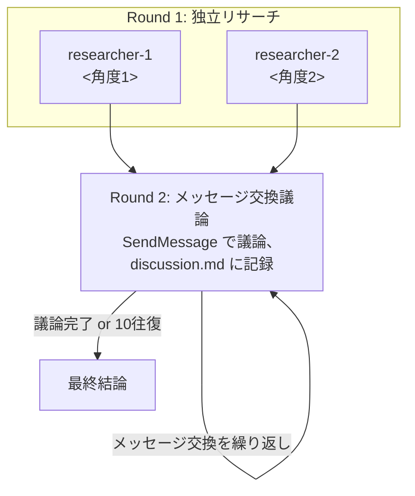
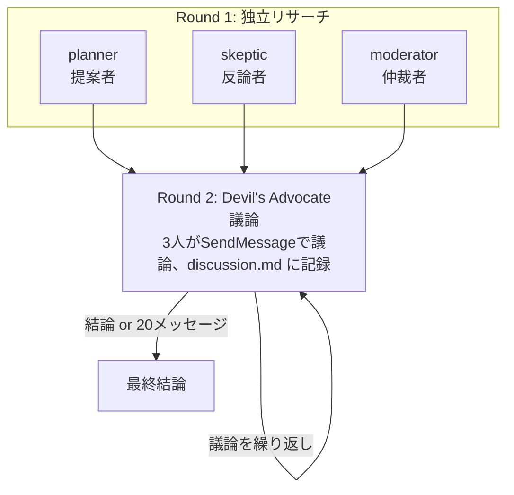

# topic-start: 調査開始コマンド

新規調査トピックの作成から調査計画・初期調査までを**連続で**実行するコマンドなのだ。
必要な確認（前提情報・タグ選択）だけを挟み、それ以外は自動で進めるのだ。

---

## 実行モデル: 連続実行（必要時のみ確認）

### 通常モード

```
Phase 1 → Phase 2（前提確認※必要時のみ）→ Phase 3 → Phase 4 → Phase 5（タグ選択）→ Phase 6
```

### チーム並列ディスカッションモード（「ぞす」検出時）

```
Phase 1 → Phase 2（前提確認※必要時のみ）→ Phase 3T（チーム作成＋計画）→ Phase 4A（並列リサーチ）→ Phase 4B（並列ディスカッション）→ Phase 4C（結論統合＋チーム解散）→ Phase 5（タグ選択）→ Phase 6T
```

### チームメッセージディスカッションモード（「ぞすめ」検出時）

```
Phase 1 → Phase 2（前提確認※必要時のみ）→ Phase 3T（チーム作成＋計画）→ Phase 4A（並列リサーチ）→ Phase 4B-zosume（メッセージ交換議論: discussion.mdに記録）→ Phase 4C（結論統合＋チーム解散）→ Phase 5（タグ選択）→ Phase 6T
```

### Devil's Advocateモード（「ぞすでびる」検出時）

```
Phase 1 → Phase 2（前提確認※必要時のみ）→ Phase 3T（チーム作成＋計画）→ Phase 4A（並列リサーチ）→ Phase 4B-zosudevil（3人議論: discussion.mdに記録）→ Phase 4C（結論統合＋チーム解散）→ Phase 5（タグ選択）→ Phase 6T
```

**確認ポイント:**
- Phase 2: 前提情報が不足している場合のみユーザーに確認
- Phase 5: タグ選択はユーザーに選択を求める

---

## Agent 連携による実行（Task tool使用）

このコマンドは**Task tool・Team Agent（TeamCreate/SendMessage/TeamDelete）を使って複数のAgentを連携させる**。

**重要**: 各Phaseで指定されたAgent/Toolを**必ず指定された方法で呼び出す**こと。

### 通常モード

| Phase | Agent | subagent_type |
|-------|-------|---------------|
| 1 | Topic Management Agent | `topic-management-agent` |
| 3 | General Purpose Agent | `general-purpose` |
| 4 | Topic Research Agent | `topic-research-agent` |
| 5 | Topic Tag Suggest Agent | `topic-tag-suggest-agent` |

### チーム並列ディスカッションモード（「ぞす」）

| Phase | Agent/Tool | 備考 |
|-------|-----------|------|
| 1 | Topic Management Agent (`topic-management-agent`) | トピック作成 |
| 3T | **TeamCreate** + General Purpose Agent (`general-purpose`) | チーム作成＋タスク策定 |
| 4A | **Task** x2 (`topic-research-agent`, `team_name`指定) | チームメンバーとして**並列スポーン** |
| 4B | **SendMessage** x2 → researcher-1, researcher-2 | ディスカッション指示（メンバー再利用） |
| 4C | メインコンテキスト + **SendMessage**(shutdown) + **TeamDelete** | 結論統合＋チーム解散 |
| 5 | Topic Tag Suggest Agent (`topic-tag-suggest-agent`) | タグ提案・付与 |

### チームメッセージディスカッションモード（「ぞすめ」）

| Phase | Agent/Tool | 備考 |
|-------|-----------|------|
| 1 | Topic Management Agent (`topic-management-agent`) | トピック作成 |
| 3T | **TeamCreate** + General Purpose Agent (`general-purpose`) | チーム作成＋タスク策定 |
| 4A | **Task** x2 (`topic-research-agent`, `team_name`指定) | チームメンバーとして**並列スポーン** |
| 4B-zosume | **SendMessage**（交互）→ researcher-1/2 | メッセージ交換議論（最大10往復、各500文字以内） |
| 4C | メインコンテキスト + **SendMessage**(shutdown) + **TeamDelete** | 結論統合＋チーム解散 |
| 5 | Topic Tag Suggest Agent (`topic-tag-suggest-agent`) | タグ提案・付与 |

### Devil's Advocateモード（「ぞすでびる」）

| Phase | Agent/Tool | 備考 |
|-------|-----------|------|
| 1 | Topic Management Agent (`topic-management-agent`) | トピック作成 |
| 3T | **TeamCreate** + General Purpose Agent (`general-purpose`) | チーム作成＋タスク策定 |
| 4A | **Task** x3 (`topic-research-agent`, `team_name`指定) | チームメンバー3人を**並列スポーン** |
| 4B-zosudevil | **SendMessage**（交互）→ planner/skeptic/moderator | 3人議論（合計最大20メッセージ、各500文字以内） |
| 4C | メインコンテキスト + **SendMessage**(shutdown) + **TeamDelete** | 結論統合＋チーム解散 |
| 5 | Topic Tag Suggest Agent (`topic-tag-suggest-agent`) | タグ提案・付与 |

---

## User Input

```text
$ARGUMENTS
```

---

## パラメータ解析

User Inputから以下を抽出:

- **topic_name**: 調査テーマ（必須）
- **tags**: `--tags` オプションの値（オプション）
- **team_mode**: 入力が「ぞす」「ぞすめ」「ぞすでびる」のいずれかで終わっているかどうか（自動判定）
- **discussion_mode**: チームモード時のディスカッション方式（`"parallel"` / `"message"` / `"devil"`）

### 「ぞす」「ぞすめ」「ぞすでびる」検出ルール

**検出順序が重要**: 先に長いキーワードからチェックする（「ぞすでびる」→「ぞすめ」→「ぞす」）。

1. User Input の末尾（`--tags` を除いた本文部分）を判定:
   - **「ぞすでびる」で終わっている場合**:
     - `team_mode = true`
     - `discussion_mode = "devil"`（Devil's Advocate議論）
     - `topic_name` から末尾の「ぞすでびる」を除去（トリム）
   - **「ぞすめ」で終わっている場合**（「ぞすでびる」ではない）:
     - `team_mode = true`
     - `discussion_mode = "message"`（メッセージ交換議論）
     - `topic_name` から末尾の「ぞすめ」を除去（トリム）
   - **「ぞす」で終わっている場合**（「ぞすめ」「ぞすでびる」ではない）:
     - `team_mode = true`
     - `discussion_mode = "parallel"`（並列ディスカッション）
     - `topic_name` から末尾の「ぞす」を除去（トリム）
   - **どれでもない場合**:
     - `team_mode = false`（通常モード）

### 解析例

**通常モード:**
```
/topic-start Claude Codeのhooks機能について調査 --tags #tech/ai,#claude
```
→ topic_name: "Claude Codeのhooks機能について調査"
→ tags: "#tech/ai,#claude"
→ team_mode: false

**チーム並列ディスカッションモード（「ぞす」）:**
```
/topic-start Claude Codeのhooks機能について調査ぞす --tags #tech/ai
```
→ topic_name: "Claude Codeのhooks機能について調査"
→ tags: "#tech/ai"
→ team_mode: true
→ discussion_mode: "parallel"

**チームメッセージディスカッションモード（「ぞすめ」）:**
```
/topic-start マイクロサービス vs モノリスの比較検討ぞすめ
```
→ topic_name: "マイクロサービス vs モノリスの比較検討"
→ tags: (なし)
→ team_mode: true
→ discussion_mode: "message"

```
/topic-start Claude Code vs Cursor比較ぞすめ --tags #tech/ai
```
→ topic_name: "Claude Code vs Cursor比較"
→ tags: "#tech/ai"
→ team_mode: true
→ discussion_mode: "message"

**Devil's Advocateモード（「ぞすでびる」）:**
```
/topic-start React vs Vue どっちが良いかぞすでびる
```
→ topic_name: "React vs Vue どっちが良いか"
→ tags: (なし)
→ team_mode: true
→ discussion_mode: "devil"

```
/topic-start TypeScript導入の是非についてぞすでびる --tags #tech/dev
```
→ topic_name: "TypeScript導入の是非について"
→ tags: "#tech/dev"
→ team_mode: true
→ discussion_mode: "devil"

---

## Phase 1: トピック作成

### Task toolで topic-management-agent を呼び出す

**必ず以下のようにTask toolを使用すること:**

```
Task({
  subagent_type: "topic-management-agent",
  description: "新規トピック作成",
  prompt: `
    mode: create
    topic_name: <抽出したテーマ>
    tags: <抽出したタグ（あれば）>

    実行内容:
    1. トピック名をslug化
    2. フォルダ作成: topics/YYYYMMDD_<slug>/
    3. テンプレートファイル生成
    4. index.md を更新
  `
})
```

→ **Agentの完了を待ってから Phase 2 へ進む**

---

## Phase 2: 前提情報の確認（ヒアリング）

調査を開始する前に、重要な前提情報を確認するのだ。

**注意**: このPhaseはメインコンテキストで実行する（Agentは呼び出さない）

### 前提チェックリストを評価

以下の観点で、ユーザーが提供した情報を分析:

| チェック項目 | 確認内容 |
|------------|---------|
| 調査の目的・ゴール | 何を達成したいのか明確か？ |
| 背景・文脈 | なぜこの調査が必要か理解できるか？ |
| 既知の情報 | 既に知っていることは何か？ |
| 具体的な関心事 | 特に深掘りしたい観点はあるか？ |
| 制約条件 | 時間、スコープ、技術的制約はあるか？ |
| 期待するアウトプット | レポート形式？判断材料？学習目的？ |

### 確認が必要な場合のみ質問

**重要**: ユーザーの入力から目的や背景が十分に推測できる場合は、質問をスキップして Phase 3 に進む。

不足情報がある場合のみ `AskUserQuestion` で確認（最大2つまで）:

```
AskUserQuestion({
  questions: [
    {
      question: "この調査の主な目的は？",
      header: "調査目的",
      options: [
        { label: "技術選定のため", description: "複数の選択肢を比較検討" },
        { label: "学習・理解を深めるため", description: "知識を増やしたい" },
        { label: "課題解決のため", description: "具体的な問題を解決したい" }
      ],
      multiSelect: false
    }
  ]
})
```

### 前提情報の記録

確認した前提情報を research.md に記録:

```markdown
## 調査の前提

- **目的**: <確認した目的>
- **背景**: <背景情報>
- **既知情報**: <既に分かっていること>
- **重視する観点**: <特に調べたいこと>
- **制約・条件**: <あれば記載>
```

→ **`team_mode` の値に応じて分岐:**
- `team_mode = false` → Phase 3（通常モード）へ進む
- `team_mode = true` → Phase 3T（チームディスカッションモード）へ進む
  - `discussion_mode = "parallel"` → Phase 4B（並列ディスカッション）
  - `discussion_mode = "message"` → Phase 4B-zosume（メッセージ交換議論）
  - `discussion_mode = "devil"` → Phase 4B-zosudevil（Devil's Advocate議論）

---

# ============================
# 通常モード（Phase 3〜4）
# ============================

## Phase 3: 調査計画の策定

### Task toolで general-purpose agent を呼び出す

**必ず以下のようにTask toolを使用すること:**

```
Task({
  subagent_type: "general-purpose",
  description: "調査計画をタスクとして登録",
  prompt: `
    topic_folder: <Phase 1で作成されたフォルダパス>

    以下の調査計画を策定し、tasks.md に記録してください:

    1. 調査目的を明確化
       - Phase 2 で確認した前提情報: <前提情報>
       - 何を明らかにしたいか

    2. 調査項目をリストアップ（3〜5個）
       - 優先順位をつける

    3. <topic_folder>/tasks.md の「進行中」セクションにタスクとして追加:
       - [ ] 調査項目1: <具体的な内容>
       - [ ] 調査項目2: <具体的な内容>
       - [ ] 調査項目3: <具体的な内容>
  `
})
```

→ **Agentの完了を待ってから Phase 4 へ進む**

---

## Phase 4: 初期調査の実行と暫定結論の作成

### Task toolで topic-research-agent を呼び出す

**必ず以下のようにTask toolを使用すること:**

```
Task({
  subagent_type: "topic-research-agent",
  description: "初期調査を実行し暫定結論を作成",
  prompt: `
    topic_folder: <Phase 1で作成されたフォルダパス>
    topic_name: <トピック名>

    以下の調査を実行してください:

    1. WebSearch で関連情報を収集
       - 調査計画の優先項目から順に検索
       - 最低3つ以上の情報源を確保

    2. research.md に調査結果を記録
       - タイムスタンプ付きで追記
       - ソースURLを必ず記載

    3. 暫定結論を conclusion.md に作成
       以下の形式で記録:

       # 暫定結論

       > ⚠️ これは初期調査段階の暫定結論です。追加調査により更新される可能性があります。

       ## 現時点での主要な発見
       - <発見1>
       - <発見2>
       - <発見3>

       ## 暫定的な回答/結論
       <調査目的に対する現時点での回答>

       ## 未解明の点・追加調査が必要な領域
       - <未解明点1>
       - <未解明点2>

       ---
       *最終更新: YYYY-MM-DD HH:MM*

    4. 完了した調査項目を報告
  `
})
```

→ **Agentの完了を待ってから Phase 5 へ進む**

---

# ============================================
# チームディスカッションモード（Phase 3T〜4C）
# ============================================

> **このモードでは Team Agent（TeamCreate / SendMessage / TeamDelete）を使用する。**
> チームメンバーは Round 1（独立リサーチ）→ Round 2（ディスカッション）を通じて
> 同一プロセスとして持続し、SendMessage で新しい作業を指示する。
>
> **ディスカッション方式は `discussion_mode` で決定される:**
> - `"parallel"`: Phase 4B（並列ディスカッション）— 各自が別ファイルに同時に書く
> - `"message"`: Phase 4B-zosume（メッセージ交換議論）— agent同士がmessageで議論、discussion.mdに記録
> - `"devil"`: Phase 4B-zosudevil（Devil's Advocate議論）— 3人のagent（Planner/Skeptic/Moderator）が議論

## Phase 3T: チーム作成と調査計画の策定

**注意**: `team_mode = true` の場合のみ実行（Phase 3 の代わり）

### Step 1: メインコンテキストで調査角度を決定

チームディスカッションモードでは、**2つの異なる調査角度（アングル）** を設定する。

1. トピックのテーマから、2つの補完的な調査角度を決定:
   - **角度1**: テーマの一側面（例: 技術面、メリット側、理論面）
   - **角度2**: テーマの別の側面（例: 運用面、デメリット側、実践面）

2. 各角度に対して短いslugを生成:
   - 例: "technical-analysis", "practical-evaluation"

### Step 2: TeamCreate でチームを作成

```
TeamCreate({
  team_name: "topic-<トピックslug>",
  description: "<トピック名>の調査チーム"
})
```

### Step 3: 調査角度を research.md に記録

```markdown
## チーム調査計画

**モード**: チームディスカッション（Team Agent使用）
**ディスカッション方式**: <"parallel"（並列）or "sequential"（逐次）>
**チーム名**: topic-<トピックslug>

### Agent 1 担当角度（researcher-1）
- **テーマ**: <角度1の説明>
- **出力ファイル**: 1-<angle1-slug>.md

### Agent 2 担当角度（researcher-2）
- **テーマ**: <角度2の説明>
- **出力ファイル**: 2-<angle2-slug>.md
```

### Step 4: Task toolで general-purpose agent を呼び出してタスク策定

```
Task({
  subagent_type: "general-purpose",
  description: "チーム調査計画をタスクとして登録",
  prompt: `
    topic_folder: <Phase 1で作成されたフォルダパス>

    以下のチーム調査計画を策定し、tasks.md に記録してください:

    1. 調査目的を明確化
       - Phase 2 で確認した前提情報: <前提情報>
       - チームディスカッションモードで実施
       - ディスカッション方式: <discussion_mode>

    2. <topic_folder>/tasks.md の「進行中」セクションにタスクを追加:

    === discussion_mode = "parallel" の場合 ===
       - [ ] [Round1] researcher-1 独立リサーチ: <角度1の説明>
       - [ ] [Round1] researcher-2 独立リサーチ: <角度2の説明>
       - [ ] [Round2] researcher-1 ディスカッション: researcher-2の結果を読み、議論・ブラッシュアップ
       - [ ] [Round2] researcher-2 ディスカッション: researcher-1の結果を読み、議論・ブラッシュアップ
       - [ ] 結論統合: 全ディスカッション結果をconclusion.mdに統合

    === discussion_mode = "message" の場合 ===
       - [ ] [Round1] researcher-1 独立リサーチ: <角度1の説明>
       - [ ] [Round1] researcher-2 独立リサーチ: <角度2の説明>
       - [ ] [Round2] メッセージ交換議論: agent同士がSendMessageで議論（最大10往復、各500文字以内）
       - [ ] 結論統合: ディスカッション結果をconclusion.mdに統合

    === discussion_mode = "devil" の場合 ===
       - [ ] [Round1] planner 独立リサーチ: 提案者としての調査
       - [ ] [Round1] skeptic 独立リサーチ: 反論者としての調査
       - [ ] [Round1] moderator 独立リサーチ: 仲裁者としての調査
       - [ ] [Round2] Devil's Advocate議論: 3人がSendMessageで議論（合計最大20メッセージ、各500文字以内）
       - [ ] 結論統合: ディスカッション結果をconclusion.mdに統合
  `
})
```

→ **Agentの完了を待ってから Phase 4A へ進む**

---

## Phase 4A: チーム独立リサーチ（Round 1 - 並列実行）

### 2つの topic-research-agent をチームメンバーとして**並列で**スポーンする

**重要**: 以下の2つのTask呼び出しを**同時に（1つのメッセージで）**実行すること。
`team_name` と `name` パラメータを指定し、チームメンバーとしてスポーンする。

#### researcher-1（チームメンバーとしてスポーン）:

```
Task({
  subagent_type: "topic-research-agent",
  team_name: "topic-<トピックslug>",
  name: "researcher-1",
  description: "チームresearcher-1: 独立リサーチ",
  prompt: `
    topic_folder: <Phase 1で作成されたフォルダパス>
    topic_name: <トピック名>
    team_mode: true
    agent_number: 1
    output_file: 1-<angle1-slug>.md
    research_angle: <角度1の説明>

    あなたはチーム「topic-<トピックslug>」の researcher-1 です。
    以下の角度から独立して調査を実施してください。

    ## 担当角度
    <角度1の詳細説明>

    ## 実行内容
    1. WebSearch で担当角度に関する情報を収集
       - 最低3つ以上の情報源を確保
       - 担当角度に特化した検索クエリを使用

    2. 調査結果を **<topic_folder>/1-<angle1-slug>.md** に記録
       以下の形式で記録:

       # Agent 1 調査結果: <角度1のタイトル>

       ## 調査角度
       <何を調査したか>

       ## 主要な発見
       - <発見1>（ソース: URL）
       - <発見2>（ソース: URL）
       - <発見3>（ソース: URL）

       ## 詳細分析
       <詳細な分析内容>

       ## 暫定的な見解
       <この角度から見た暫定的な結論>

       ## 参考リンク
       - [リンク1](URL1)
       - [リンク2](URL2)

       ---
       *researcher-1 / Round 1 / YYYY-MM-DD HH:MM*

    3. research.md にも調査メモを追記（タイムスタンプ付き、[researcher-1]プレフィックス付き）

    4. **調査完了後、チームリーダーに SendMessage で完了を報告すること**

    **重要**: 他のメンバーの結果は参照せず、独立して調査すること。
  `
})
```

#### researcher-2（チームメンバーとしてスポーン）:

```
Task({
  subagent_type: "topic-research-agent",
  team_name: "topic-<トピックslug>",
  name: "researcher-2",
  description: "チームresearcher-2: 独立リサーチ",
  prompt: `
    topic_folder: <Phase 1で作成されたフォルダパス>
    topic_name: <トピック名>
    team_mode: true
    agent_number: 2
    output_file: 2-<angle2-slug>.md
    research_angle: <角度2の説明>

    あなたはチーム「topic-<トピックslug>」の researcher-2 です。
    以下の角度から独立して調査を実施してください。

    ## 担当角度
    <角度2の詳細説明>

    ## 実行内容
    1. WebSearch で担当角度に関する情報を収集
       - 最低3つ以上の情報源を確保
       - 担当角度に特化した検索クエリを使用

    2. 調査結果を **<topic_folder>/2-<angle2-slug>.md** に記録
       以下の形式で記録:

       # Agent 2 調査結果: <角度2のタイトル>

       ## 調査角度
       <何を調査したか>

       ## 主要な発見
       - <発見1>（ソース: URL）
       - <発見2>（ソース: URL）
       - <発見3>（ソース: URL）

       ## 詳細分析
       <詳細な分析内容>

       ## 暫定的な見解
       <この角度から見た暫定的な結論>

       ## 参考リンク
       - [リンク1](URL1)
       - [リンク2](URL2)

       ---
       *researcher-2 / Round 1 / YYYY-MM-DD HH:MM*

    3. research.md にも調査メモを追記（タイムスタンプ付き、[researcher-2]プレフィックス付き）

    4. **調査完了後、チームリーダーに SendMessage で完了を報告すること**

    **重要**: 他のメンバーの結果は参照せず、独立して調査すること。
  `
})
```

→ **両方（または3人）のチームメンバーからの完了報告（SendMessage）を待ってから次のPhaseへ進む**
→ チームメンバーは idle 状態になるが、SendMessage により再利用する
→ **`discussion_mode` に応じて分岐:**
  - `"parallel"` → Phase 4B（並列ディスカッション）へ
  - `"message"` → Phase 4B-zosume（メッセージ交換議論）へ
  - `"devil"` → Phase 4B-zosudevil（Devil's Advocate議論）へ

---

## Phase 4B: チーム並列ディスカッション（Round 2 - SendMessageで指示）

> **`discussion_mode = "parallel"` の場合のみ実行。** 他のモードの場合は Phase 4B-zosume または Phase 4B-zosudevil へスキップ。

### 既存のチームメンバーに SendMessage でディスカッション指示を送る

Phase 4A でスポーンしたチームメンバーは idle 状態で待機している。
**新たに Task でスポーンし直す必要はない。** SendMessage で新しい作業指示を送り、ディスカッションラウンドを開始する。

**重要**: 以下の2つの SendMessage 呼び出しを**同時に（1つのメッセージで）**実行すること。

#### researcher-1 へディスカッション指示:

```
SendMessage({
  type: "message",
  recipient: "researcher-1",
  summary: "Round 2 ディスカッション指示",
  content: `
    ディスカッションラウンド（Round 2）を開始してください。

    ## ディスカッションの手順

    1. **自身の調査結果を確認**
       - ファイル: <topic_folder>/1-<angle1-slug>.md

    2. **他メンバーの調査結果を読み込む**
       - ファイル: <topic_folder>/2-<angle2-slug>.md

    3. **両方の調査結果を比較・統合して議論する**
       以下の観点で検討:
       - 両者の発見で一致している点は何か
       - 矛盾や対立する見解はあるか
       - 相手の調査で自分が見落としていた重要な点は何か
       - 両方の視点を統合すると、どのような結論が導けるか

    4. **ディスカッション結果を <topic_folder>/1-discussion.md に記録**
       以下の形式で記録:

       # Agent 1 ディスカッション結果

       ## 議論の概要
       researcher-1（<角度1>）の視点から、researcher-2（<角度2>）の調査結果を踏まえた総合的な分析。

       ## 一致点
       - <両者で共通する発見1>
       - <両者で共通する発見2>

       ## 新たな気づき・補完された点
       - <Agent 2の調査から得られた新しい視点1>
       - <Agent 2の調査から得られた新しい視点2>

       ## 対立点・異なる見解
       - <見解の相違1>: researcher-1は〜、researcher-2は〜
       - <見解の相違があれば>

       ## 統合的な結論
       <両方の視点を踏まえた統合的な結論>

       ## 推奨事項
       - <推奨1>
       - <推奨2>

       ---
       *researcher-1 / Round 2 (Discussion) / YYYY-MM-DD HH:MM*

    **重要**: 単に両者をまとめるだけでなく、批判的に検討し、より深い洞察を導き出すこと。
    完了後、チームリーダーに SendMessage で完了を報告すること。
  `
})
```

#### researcher-2 へディスカッション指示:

```
SendMessage({
  type: "message",
  recipient: "researcher-2",
  summary: "Round 2 ディスカッション指示",
  content: `
    ディスカッションラウンド（Round 2）を開始してください。

    ## ディスカッションの手順

    1. **自身の調査結果を確認**
       - ファイル: <topic_folder>/2-<angle2-slug>.md

    2. **他メンバーの調査結果を読み込む**
       - ファイル: <topic_folder>/1-<angle1-slug>.md

    3. **両方の調査結果を比較・統合して議論する**
       以下の観点で検討:
       - 両者の発見で一致している点は何か
       - 矛盾や対立する見解はあるか
       - 相手の調査で自分が見落としていた重要な点は何か
       - 両方の視点を統合すると、どのような結論が導けるか

    4. **ディスカッション結果を <topic_folder>/2-discussion.md に記録**
       以下の形式で記録:

       # Agent 2 ディスカッション結果

       ## 議論の概要
       researcher-2（<角度2>）の視点から、researcher-1（<角度1>）の調査結果を踏まえた総合的な分析。

       ## 一致点
       - <両者で共通する発見1>
       - <両者で共通する発見2>

       ## 新たな気づき・補完された点
       - <Agent 1の調査から得られた新しい視点1>
       - <Agent 1の調査から得られた新しい視点2>

       ## 対立点・異なる見解
       - <見解の相違1>: researcher-2は〜、researcher-1は〜
       - <見解の相違があれば>

       ## 統合的な結論
       <両方の視点を踏まえた統合的な結論>

       ## 推奨事項
       - <推奨1>
       - <推奨2>

       ---
       *researcher-2 / Round 2 (Discussion) / YYYY-MM-DD HH:MM*

    **重要**: 単に両者をまとめるだけでなく、批判的に検討し、より深い洞察を導き出すこと。
    完了後、チームリーダーに SendMessage で完了を報告すること。
  `
})
```

→ **両方のチームメンバーからの完了報告（SendMessage）を待ってから Phase 4C へ進む**

---

## Phase 4B-zosume: チームメッセージディスカッション（Round 2 - agent間メッセージ交換）

> **`discussion_mode = "message"` の場合のみ実行。** 他のモードの場合はスキップ。

### 設計思想

agent同士がSendMessageで直接メッセージを送りあって議論する方式。discussion.mdに議論内容を記録する。

### 終了条件（厳守）

以下の**いずれか**が満たされた時点でディスカッションを終了する:

1. **議論完了条件**: 明確に優劣がはっきりする、または議論すべきところを一通り完了した
2. **回数上限**: **10往復**（researcher-1 と researcher-2 の合計20メッセージ）に達した

**重要**:
- 各メッセージは最大500文字程度に抑える
- メッセージ送信時は必ずdiscussion.mdに内容を追記する

### Step 1: discussion.md の初期化

リーダー（メインコンテキスト）が `<topic_folder>/discussion.md` を作成:

```markdown
# メッセージ交換議論: <トピック名>

> researcher-1（<角度1>）と researcher-2（<角度2>）によるメッセージ交換議論。
> agent同士がSendMessageで議論を行い、この文書に記録される。

**ディスカッション方式**: メッセージ交換
**終了条件**: 議論完了 or 最大10往復（合計20メッセージ）
**開始時刻**: YYYY-MM-DD HH:MM

---

```

### Step 2: researcher-1 に議論開始を指示

```
SendMessage({
  type: "message",
  recipient: "researcher-1",
  summary: "メッセージ議論開始",
  content: `
    メッセージ交換議論（Round 2）を開始してください。

    ## あなたの役割
    あなたは researcher-1（<角度1>）の立場から議論します。

    ## 手順
    1. **自身の調査結果を確認**: <topic_folder>/1-<angle1-slug>.md
    2. **相手の調査結果を読み込む**: <topic_folder>/2-<angle2-slug>.md
    3. **researcher-2 にSendMessageで初回メッセージを送信**
       - メッセージ内容: 自身の調査結果を踏まえた主張と相手への質問（最大500文字）
    4. **同時に<topic_folder>/discussion.mdに議論内容を追記**

    ## discussion.md 記録フォーマット

    ## [YYYY-MM-DD HH:MM] researcher-1 → researcher-2

    <送信したメッセージ内容>

    ---

    ## ルール
    - メッセージは最大500文字程度
    - SendMessageとdiscussion.md追記を両方行うこと
    - 相手からの返信を受けたら、議論を深める応答を送る
    - 議論が完了したと判断したら、チームリーダーに報告

    ## 議論完了の判断基準
    - 明確に優劣がはっきりした
    - 議論すべき主要ポイントを一通り完了した
    - 10往復（20メッセージ）に達した

    完了時はチームリーダーに SendMessage で報告してください。
  `
})
```

### Step 3: 議論のモニタリングと終了判定

リーダーは以下をモニタリング:

1. discussion.mdの更新状況を確認
2. 往復数をカウント（最大10往復）
3. いずれかのresearcherから議論完了の報告を受ける

→ **議論完了の報告を受けるか、10往復に達したら Phase 4C へ進む**

---

## Phase 4B-zosudevil: Devil's Advocate議論（Round 2 - 3人議論）

> **`discussion_mode = "devil"` の場合のみ実行。** 他のモードの場合はスキップ。

### 設計思想

3人のagent（Planner提案者、Skeptic反論者、Moderator仲裁者）がSendMessageで議論を行う方式。
discussion.mdに議論内容を記録する。

### Phase 4A の修正（devil モード専用）

**注意**: `discussion_mode = "devil"` の場合、Phase 4A では3人のresearcherをスポーンする必要がある:

```
Task({
  subagent_type: "topic-research-agent",
  team_name: "topic-<トピックslug>",
  name: "planner",
  description: "チームplanner: 提案者として独立リサーチ",
  prompt: `<提案者としての調査指示>`
})

Task({
  subagent_type: "topic-research-agent",
  team_name: "topic-<トピックslug>",
  name: "skeptic",
  description: "チームskeptic: 反論者として独立リサーチ",
  prompt: `<反論者としての調査指示>`
})

Task({
  subagent_type: "topic-research-agent",
  team_name: "topic-<トピックslug>",
  name: "moderator",
  description: "チームmoderator: 仲裁者として独立リサーチ",
  prompt: `<仲裁者としての調査指示>`
})
```

### 終了条件（厳守）

以下の**いずれか**が満たされた時点でディスカッションを終了する:

1. **議論完了条件**: 議論の余地がないと判断できるほど結論がついた
2. **回数上限**: **3人のメッセージ合計が20回**を超えた

**重要**:
- 各メッセージは最大500文字程度に抑える
- メッセージ送信時は必ずdiscussion.mdに内容を追記する

### Step 1: discussion.md の初期化

リーダー（メインコンテキスト）が `<topic_folder>/discussion.md` を作成:

```markdown
# Devil's Advocate議論: <トピック名>

> 3人のagent（Planner提案者、Skeptic反論者、Moderator仲裁者）によるDevil's Advocate議論。
> agent同士がSendMessageで議論を行い、この文書に記録される。

**ディスカッション方式**: Devil's Advocate（3人議論）
**終了条件**: 結論がついた or 合計20メッセージ
**開始時刻**: YYYY-MM-DD HH:MM

**役割分担**:
- Planner: 提案者（トピックに対する肯定的立場）
- Skeptic: 反論者（批判的視点でチャレンジ）
- Moderator: 仲裁者（両者の意見を整理し、議論を深める）

---

```

### Step 2: planner に議論開始を指示

```
SendMessage({
  type: "message",
  recipient: "planner",
  summary: "Devil's Advocate議論開始",
  content: `
    Devil's Advocate議論（Round 2）を開始してください。

    ## あなたの役割
    あなたは Planner（提案者）として、トピックに対する肯定的立場から議論します。

    ## 手順
    1. **自身の調査結果を確認**: <topic_folder>/1-<planner-slug>.md
    2. **他のメンバーの調査結果を読み込む**:
       - <topic_folder>/2-<skeptic-slug>.md
       - <topic_folder>/3-<moderator-slug>.md
    3. **skeptic とmoderatorにSendMessageで初回提案メッセージを送信**
       - メッセージ内容: 自身の調査結果を踏まえた提案（最大500文字）
    4. **同時に<topic_folder>/discussion.mdに議論内容を追記**

    ## discussion.md 記録フォーマット

    ## [YYYY-MM-DD HH:MM] planner → skeptic, moderator

    <送信したメッセージ内容>

    ---

    ## ルール
    - メッセージは最大500文字程度
    - SendMessageとdiscussion.md追記を両方行うこと
    - 議論が完了したと判断したら、チームリーダーに報告

    ## 議論完了の判断基準
    - 議論の余地がないほど結論がついた
    - 合計20メッセージに達した

    完了時はチームリーダーに SendMessage で報告してください。
  `
})
```

### Step 3: 議論のモニタリングと終了判定

リーダーは以下をモニタリング:

1. discussion.mdの更新状況を確認
2. メッセージ総数をカウント（最大20メッセージ）
3. いずれかのメンバーから議論完了の報告を受ける

→ **議論完了の報告を受けるか、20メッセージに達したら Phase 4C へ進む**

---

## Phase 4C: 結論統合とチーム解散

**注意**: このPhaseはメインコンテキスト（チームリーダー）で実行する

### Step 1: 全ディスカッション結果の読み込みと統合

#### discussion_mode = "parallel" の場合:

1. **全ファイルを読み込む**:
   - `<topic_folder>/1-<angle1-slug>.md`（researcher-1 Round 1）
   - `<topic_folder>/2-<angle2-slug>.md`（researcher-2 Round 1）
   - `<topic_folder>/1-discussion.md`（researcher-1 Round 2）
   - `<topic_folder>/2-discussion.md`（researcher-2 Round 2）

2. **統合分析**:
   - 両方のディスカッション結果で共通する結論を抽出
   - 各メンバーが独自に提起した重要なポイントを拾う
   - 対立点があれば、より強い根拠に基づく見解を採用

#### discussion_mode = "message" の場合:

1. **全ファイルを読み込む**:
   - `<topic_folder>/1-<angle1-slug>.md`（researcher-1 Round 1）
   - `<topic_folder>/2-<angle2-slug>.md`（researcher-2 Round 1）
   - `<topic_folder>/discussion.md`（メッセージ交換議論記録）

2. **統合分析**:
   - discussion.md の議論の流れを時系列で追う
   - agent同士のメッセージ交換から導き出された結論を抽出
   - 合意に至った点と対立した点を明確に区別

#### discussion_mode = "devil" の場合:

1. **全ファイルを読み込む**:
   - `<topic_folder>/1-<planner-slug>.md`（planner Round 1）
   - `<topic_folder>/2-<skeptic-slug>.md`（skeptic Round 1）
   - `<topic_folder>/3-<moderator-slug>.md`（moderator Round 1）
   - `<topic_folder>/discussion.md`（Devil's Advocate議論記録）

2. **統合分析**:
   - discussion.md の3者間議論の流れを分析
   - Planner（提案）、Skeptic（反論）、Moderator（仲裁）の各視点を整理
   - 最終的に導き出された結論と、各役割が貢献したポイントを明確化

3. **conclusion.md に最終結論を作成**:

```markdown
# <トピック名>

> このドキュメントは、2人のAIエージェントによるチームディスカッション（Team Agent使用）を経て作成された最終結論です。

## 概要
<トピックの全体像を3-5文で要約>

## 調査プロセス

<!-- discussion_mode = "parallel" の場合 -->


<!-- discussion_mode = "message" の場合は以下を使用 -->


<!-- discussion_mode = "devil" の場合は以下を使用 -->


## 主要な発見

### 両エージェント共通の発見
- <共通発見1>
- <共通発見2>

### researcher-1（<角度1>）からの重要な知見
- <researcher-1固有の発見>

### researcher-2（<角度2>）からの重要な知見
- <researcher-2固有の発見>

## 詳細分析
<統合的な詳細分析>

## 結論
<最終的な結論>

## 推奨事項・次のアクション
- <推奨1>
- <推奨2>

## 残された課題
- <未解明点1>
- <未解明点2>

## 参考リンク
- [リンク1](URL1)
- [リンク2](URL2)

---
*チームディスカッション完了: YYYY-MM-DD HH:MM*
*チーム: topic-<トピックslug>*
*参加メンバー: researcher-1（<角度1>）, researcher-2（<角度2>）*
```

### Step 2: チームメンバーのシャットダウン

両メンバーに shutdown_request を**同時に（1つのメッセージで）**送信する:

```
SendMessage({
  type: "shutdown_request",
  recipient: "researcher-1",
  content: "調査完了。お疲れ様でした。"
})
```

```
SendMessage({
  type: "shutdown_request",
  recipient: "researcher-2",
  content: "調査完了。お疲れ様でした。"
})
```

### Step 3: チームの解散

両メンバーのシャットダウンが完了した後、TeamDelete でチームを解散する:

```
TeamDelete()
```

→ **Phase 5 へ進む**

---

# ============================
# 共通フェーズ（Phase 5〜6）
# ============================

## Phase 5: タグ提案・付与

### Task toolで topic-tag-suggest-agent を呼び出す

**必ず以下のようにTask toolを使用すること:**

```
Task({
  subagent_type: "topic-tag-suggest-agent",
  description: "タグを提案・付与",
  prompt: `
    topic_folder: <Phase 1で作成されたフォルダパス>
    topic_name: <トピック名>

    以下を実行してください:

    1. 既存タグの収集
       - ワークスペース内の全トピックからタグを収集
       - 使用頻度をカウント

    2. タグ候補の生成
       - トピック名と調査内容から適切なタグを分析
       - 既存タグから該当するものをリストアップ
       - 新規タグを最大3つまで提案

    3. AskUserQuestion でユーザーに選択を求める

    4. 選択されたタグを付与
       - conclusion.md に追記
       - index.md を更新
  `
})
```

→ **Agentの完了を待ってから Phase 6 へ進む**

---

## Phase 6: 追加調査の提案と次のアクション案内

**注意**: このPhaseはメインコンテキストで実行する（Agentは呼び出さない）

### 通常モードの場合

調査結果を総括し次のアクションを提案:

1. **調査結果の総括**
   - 初期調査で判明したことを簡潔にまとめる
   - 暫定結論の要点を確認

2. **追加調査の提案**
   - research.md の調査結果から、さらに調べると良さそうなトピックを特定
   - 未解明の点や深掘りすべき領域を提案
   - 具体的な追加調査クエリを例示

3. **次のアクションを案内**
   ```
   💡 次のステップ:

   【追加調査をする場合】
   - /topic-research <追加クエリ> で追加調査
     例: /topic-research <具体的な追加調査項目>
     ※ 追加調査を実行すると、research.md に調査メモが追記され、
       conclusion.md にも追加調査セクションが追記されます

   【調査を終了する場合】
   - /topic-archive でトピックをアーカイブ
   ```

### チームディスカッションモードの場合（Phase 6T）

チームディスカッションの結果を総括:

1. **チームディスカッション結果の総括**
   - 各Agentの調査角度と主な発見を要約
   - ディスカッションで深まった点を強調
   - 最終結論の要点を確認

2. **チーム調査の成果物一覧**

3. **次のアクションを案内**
   ```
   💡 次のステップ:

   【追加調査をする場合】
   - /topic-research <追加クエリ> で追加調査
     ※ 追加調査を実行すると、research.md に調査メモが追記され、
       conclusion.md にも追加調査セクションが追記されます

   【調査を終了する場合】
   - /topic-archive でトピックをアーカイブ
   ```

---

## 出力形式

### 通常モード

```
📁 調査トピック作成完了

トピック: <テーマ名>
フォルダ: topics/YYYYMMDD_slug/

🏷️ タグ:
- <付与されたタグ1>
- <付与されたタグ2>

📋 調査計画:
1. <調査項目1>
2. <調査項目2>
3. <調査項目3>

📝 初期調査結果:
- <主要な発見1>
- <主要な発見2>
- <主要な発見3>

📄 暫定結論:
<暫定結論の要約>

🔍 追加調査の提案:
- <提案1>: /topic-research <クエリ例>
- <提案2>: /topic-research <クエリ例>

💡 次のステップ:
- /topic-research <追加クエリ> で追加調査（conclusion.mdにも追記）
- /topic-archive で調査を終了

📂 関連ファイル:
- [research.md](topics/YYYYMMDD_slug/research.md) - 調査記録
- [conclusion.md](topics/YYYYMMDD_slug/conclusion.md) - 暫定結論
- [tasks.md](topics/YYYYMMDD_slug/tasks.md) - タスクリスト
- [index.md](index.md) - トピックインデックス
```

### チーム並列ディスカッションモード（「ぞす」）

```
📁 チームディスカッション調査完了

トピック: <テーマ名>
フォルダ: topics/YYYYMMDD_slug/
モード: チーム並列ディスカッション（2エージェント）

🏷️ タグ:
- <付与されたタグ1>
- <付与されたタグ2>

👥 チーム構成:
- Agent 1: <角度1の説明>
- Agent 2: <角度2の説明>

📝 Round 1（独立リサーチ）結果:
- Agent 1: <主要な発見の要約>
- Agent 2: <主要な発見の要約>

💬 Round 2（並列ディスカッション）結果:
- 一致点: <共通する主要な発見>
- 新たな気づき: <ディスカッションで深まった点>

📄 最終結論:
<統合された最終結論の要約>

🔍 残された課題:
- <課題1>
- <課題2>

💡 次のステップ:
- /topic-research <追加クエリ> で追加調査（conclusion.mdにも追記）
- /topic-archive で調査を終了

📂 関連ファイル:
- [1-<slug>.md](topics/YYYYMMDD_slug/1-<slug>.md) - Agent 1 調査結果
- [2-<slug>.md](topics/YYYYMMDD_slug/2-<slug>.md) - Agent 2 調査結果
- [1-discussion.md](topics/YYYYMMDD_slug/1-discussion.md) - Agent 1 ディスカッション
- [2-discussion.md](topics/YYYYMMDD_slug/2-discussion.md) - Agent 2 ディスカッション
- [conclusion.md](topics/YYYYMMDD_slug/conclusion.md) - 最終結論
- [research.md](topics/YYYYMMDD_slug/research.md) - 調査記録
- [tasks.md](topics/YYYYMMDD_slug/tasks.md) - タスクリスト
- [index.md](index.md) - トピックインデックス
```

### チームメッセージディスカッションモード（「ぞすめ」）

```
📁 チームメッセージディスカッション調査完了

トピック: <テーマ名>
フォルダ: topics/YYYYMMDD_slug/
モード: チームメッセージディスカッション（2エージェント・メッセージ交換）

🏷️ タグ:
- <付与されたタグ1>
- <付与されたタグ2>

👥 チーム構成:
- researcher-1: <角度1の説明>
- researcher-2: <角度2の説明>

📝 Round 1（独立リサーチ）結果:
- researcher-1: <主要な発見の要約>
- researcher-2: <主要な発見の要約>

💬 Round 2（メッセージ交換議論）結果:
- 往復数: <N> / 10
- 結果: <議論完了 or 上限到達>
- 合意点: <合意に至った主要ポイント>
- 対立点: <対立したポイント>

📄 最終結論:
<統合された最終結論の要約>

🔍 残された課題:
- <課題1>
- <課題2>

💡 次のステップ:
- /topic-research <追加クエリ> で追加調査（conclusion.mdにも追記）
- /topic-archive で調査を終了

📂 関連ファイル:
- [1-<slug>.md](topics/YYYYMMDD_slug/1-<slug>.md) - researcher-1 調査結果
- [2-<slug>.md](topics/YYYYMMDD_slug/2-<slug>.md) - researcher-2 調査結果
- [discussion.md](topics/YYYYMMDD_slug/discussion.md) - メッセージ交換議論記録
- [conclusion.md](topics/YYYYMMDD_slug/conclusion.md) - 最終結論
- [research.md](topics/YYYYMMDD_slug/research.md) - 調査記録
- [tasks.md](topics/YYYYMMDD_slug/tasks.md) - タスクリスト
- [index.md](index.md) - トピックインデックス
```

### Devil's Advocateモード（「ぞすでびる」）

```
📁 Devil's Advocate議論調査完了

トピック: <テーマ名>
フォルダ: topics/YYYYMMDD_slug/
モード: Devil's Advocate（3エージェント議論）

🏷️ タグ:
- <付与されたタグ1>
- <付与されたタグ2>

👥 チーム構成:
- planner: 提案者
- skeptic: 反論者
- moderator: 仲裁者

📝 Round 1（独立リサーチ）結果:
- planner: <主要な発見の要約>
- skeptic: <主要な発見の要約>
- moderator: <主要な発見の要約>

💬 Round 2（Devil's Advocate議論）結果:
- メッセージ数: <N> / 20
- 結果: <結論 or 上限到達>
- 最終結論: <3者の議論から導き出された結論>

📄 最終結論:
<統合された最終結論の要約>

🔍 残された課題:
- <課題1>
- <課題2>

💡 次のステップ:
- /topic-research <追加クエリ> で追加調査（conclusion.mdにも追記）
- /topic-archive で調査を終了

📂 関連ファイル:
- [1-<slug>.md](topics/YYYYMMDD_slug/1-<slug>.md) - planner 調査結果
- [2-<slug>.md](topics/YYYYMMDD_slug/2-<slug>.md) - skeptic 調査結果
- [3-<slug>.md](topics/YYYYMMDD_slug/3-<slug>.md) - moderator 調査結果
- [discussion.md](topics/YYYYMMDD_slug/discussion.md) - Devil's Advocate議論記録
- [conclusion.md](topics/YYYYMMDD_slug/conclusion.md) - 最終結論
- [research.md](topics/YYYYMMDD_slug/research.md) - 調査記録
- [tasks.md](topics/YYYYMMDD_slug/tasks.md) - タスクリスト
- [index.md](index.md) - トピックインデックス
```

---

## 完了条件

### 通常モード

- [ ] トピックフォルダが作成済み
- [ ] 前提情報が確認・記録済み
- [ ] 調査計画が tasks.md に記録済み
- [ ] 初期調査結果が research.md に記録済み
- [ ] 暫定結論が conclusion.md に記録済み
- [ ] タグが提案・選択・付与済み
- [ ] 追加調査の提案と次のアクションが案内済み

### チーム並列ディスカッションモード（「ぞす」）

- [ ] トピックフォルダが作成済み
- [ ] 前提情報が確認・記録済み
- [ ] TeamCreate でチームが作成済み
- [ ] チーム調査計画が tasks.md に記録済み
- [ ] researcher-1 の独立リサーチ結果が `1-<slug>.md` に記録済み
- [ ] researcher-2 の独立リサーチ結果が `2-<slug>.md` に記録済み
- [ ] researcher-1 のディスカッション結果が `1-discussion.md` に記録済み
- [ ] researcher-2 のディスカッション結果が `2-discussion.md` に記録済み
- [ ] 統合された最終結論が conclusion.md に記録済み
- [ ] タグが提案・選択・付与済み
- [ ] チームメンバーのシャットダウンが完了済み
- [ ] TeamDelete でチームが解散済み
- [ ] チームディスカッション結果の総括と次のアクションが案内済み

### チームメッセージディスカッションモード（「ぞすめ」）

- [ ] トピックフォルダが作成済み
- [ ] 前提情報が確認・記録済み
- [ ] TeamCreate でチームが作成済み
- [ ] チーム調査計画が tasks.md に記録済み
- [ ] researcher-1 の独立リサーチ結果が `1-<slug>.md` に記録済み
- [ ] researcher-2 の独立リサーチ結果が `2-<slug>.md` に記録済み
- [ ] メッセージ交換議論が `discussion.md` に記録済み（終了条件を満たして終了）
- [ ] 統合された最終結論が conclusion.md に記録済み
- [ ] タグが提案・選択・付与済み
- [ ] チームメンバーのシャットダウンが完了済み
- [ ] TeamDelete でチームが解散済み
- [ ] チームディスカッション結果の総括と次のアクションが案内済み

### Devil's Advocateモード（「ぞすでびる」）

- [ ] トピックフォルダが作成済み
- [ ] 前提情報が確認・記録済み
- [ ] TeamCreate でチームが作成済み
- [ ] チーム調査計画が tasks.md に記録済み
- [ ] planner の独立リサーチ結果が `1-<slug>.md` に記録済み
- [ ] skeptic の独立リサーチ結果が `2-<slug>.md` に記録済み
- [ ] moderator の独立リサーチ結果が `3-<slug>.md` に記録済み
- [ ] Devil's Advocate議論が `discussion.md` に記録済み（終了条件を満たして終了）
- [ ] 統合された最終結論が conclusion.md に記録済み
- [ ] タグが提案・選択・付与済み
- [ ] チームメンバー3人のシャットダウンが完了済み
- [ ] TeamDelete でチームが解散済み
- [ ] Devil's Advocate議論結果の総括と次のアクションが案内済み

---

## 例

### 通常モード

```
/topic-start Claude Codeのhooks機能について調査 --tags #tech/ai,#claude
```

### チーム並列ディスカッションモード（「ぞす」）

```
/topic-start マイクロサービス vs モノリスの比較検討ぞす
```

```
/topic-start Claude Code vs Cursor、どっちがいいか調査ぞす --tags #tech/ai
```

### チームメッセージディスカッションモード（「ぞすめ」）

```
/topic-start マイクロサービス vs モノリスの比較検討ぞすめ
```

```
/topic-start Claude Code vs Cursor、どっちがいいか調査ぞすめ --tags #tech/ai
```

### Devil's Advocateモード（「ぞすでびる」）

```
/topic-start React vs Vue どっちが良いかぞすでびる
```

```
/topic-start TypeScript導入の是非についてぞすでびる --tags #tech/dev
```

---

## 注意事項

- トピック名は日本語でもOK、slugは英数字とハイフンに変換
- 同名のトピックが既に存在する場合は警告を出して確認
- 調査結果はソースURLを必ず記載すること
- **通常モード: 各Phaseで指定されたAgentは必ずTask toolを使って呼び出すこと**
- **チームディスカッションモード: Team Agent（TeamCreate/SendMessage/TeamDelete）を使用すること**
  - Phase 4A: Task tool で `team_name` と `name` を指定してチームメンバーとしてスポーン（並列）
  - Phase 4B: **新たにTask でスポーンし直さず**、SendMessage で既存メンバーにディスカッション指示を送る（並列）
  - Phase 4C: SendMessage(shutdown_request) → TeamDelete でクリーンアップ
- チームメンバーが idle 状態になるのは正常動作。次のラウンドで SendMessage により再利用される
- 「ぞす」「ぞすめ」「ぞすでびる」はトピック名には含めないこと（パラメータ解析時に除去）
- **メッセージディスカッションモード（「ぞすめ」）の特記事項**:
  - agent同士がSendMessageで直接メッセージを送りあって議論する
  - 各メッセージは最大500文字程度に抑える
  - メッセージ送信時は必ずdiscussion.mdに内容を追記する
  - 終了条件（議論完了 or 10往復）は**厳守**すること
- **Devil's Advocateモード（「ぞすでびる」）の特記事項**:
  - 3人のagent（Planner/Skeptic/Moderator）を使用する
  - Phase 4Aで3人のresearcherをスポーンする必要がある
  - 各メッセージは最大500文字程度に抑える
  - メッセージ送信時は必ずdiscussion.mdに内容を追記する
  - 終了条件（結論 or 20メッセージ）は**厳守**すること
